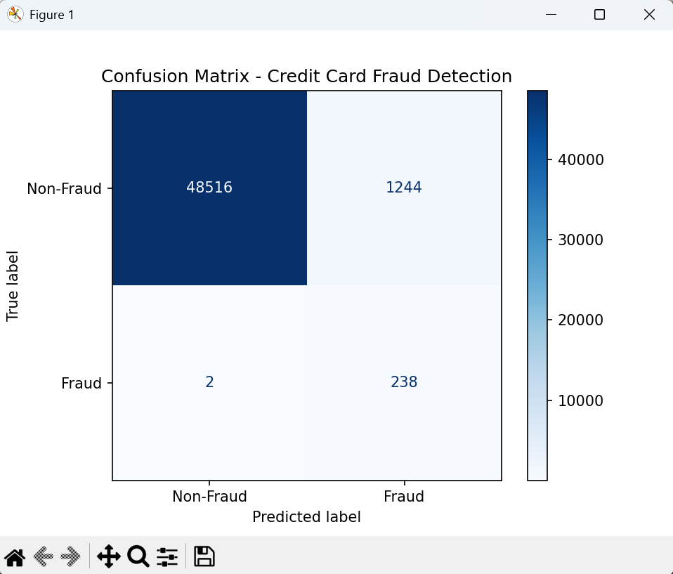
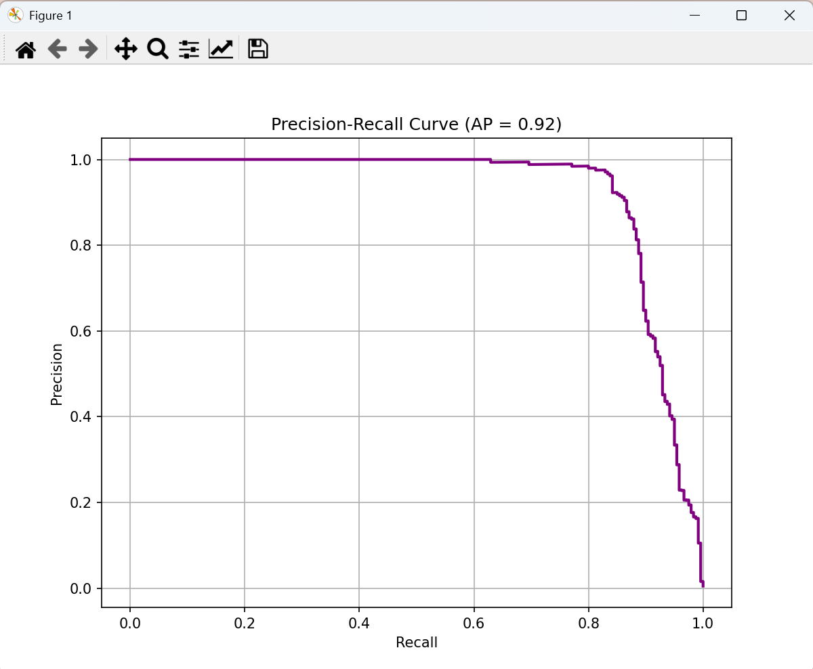
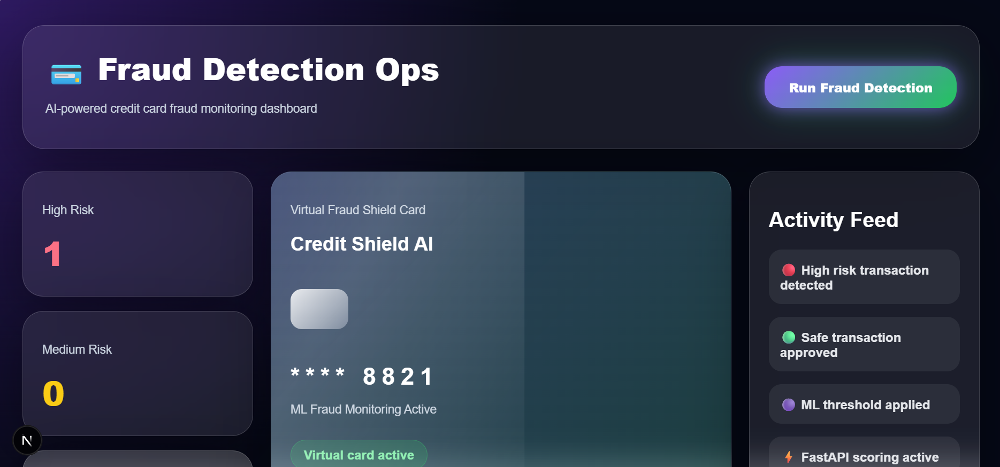
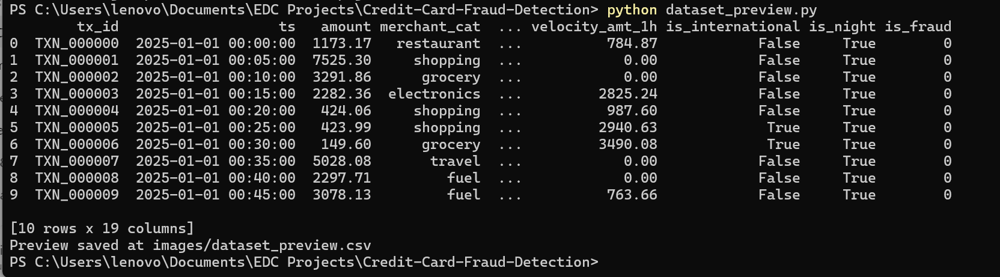

# 💳 Credit Card Fraud Detection System

🚀 An end-to-end **Machine Learning + Full Stack Project** for detecting fraudulent credit card transactions in real-time using **FastAPI backend + Next.js dashboard frontend**.

---

## 📌 Overview

This project simulates a real-world fraud detection system used by banks and fintech companies.

It:

* Detects fraudulent transactions using ML
* Provides real-time API scoring
* Displays results in a modern interactive dashboard
* Visualizes fraud insights using charts and metrics

---

## ❗ Problem Statement

Fraudulent transactions are:

* Rare (highly imbalanced data)
* Costly if missed
* Difficult to detect using traditional methods

👉 Goal: Build a system that **detects fraud accurately while minimizing missed fraud cases**

---

## 💡 Solution

Built a complete pipeline:

1. Synthetic transaction dataset generation
2. Feature engineering (behavioral + statistical features)
3. ML model (XGBoost) training
4. API deployment using FastAPI
5. Interactive dashboard using Next.js
6. Evaluation using Confusion Matrix & PR Curve

---

## 🧠 Tech Stack

### 🔹 Backend

* Python
* FastAPI
* Scikit-learn
* XGBoost
* Pandas, NumPy

### 🔹 Frontend

* Next.js
* Tailwind CSS
* Axios

### 🔹 Visualization

* Matplotlib
* Chart.js / Recharts

---

## 📁 Project Structure

```
Credit-Card-Fraud-Detection/
│
├── data/                  # Dataset
├── models/                # Trained ML model
├── src/                   # Feature engineering & training
├── serving/               # FastAPI backend
├── frontend/              # Next.js dashboard
├── images/                # Screenshots for README
├── notebooks/             # EDA notebooks
├── outputs/               # Model outputs
│
├── main.py                # Training script
├── confusion_matrix.py
├── precision_recall.py
├── dataset_preview.py
├── requirements.txt
└── README.md
```

---

## ⚙️ How Simulation Works

Since real banking data is private, simulate transactions:

* Random transaction generation
* Fraud patterns injected artificially
* Behavioral features created:

  * velocity_ratio
  * avg_tx_amt_24h
  * log_amount
  * is_weekend

👉 This mimics real-world fraud detection scenarios

---

## 🚀 Setup & Installation

### 1️⃣ Clone Repository

```
git clone https://github.com/VaidehiDeore/Credit-Card-Fraud-Detection-System.git
cd Credit-Card-Fraud-Detection-System
```

---

### 2️⃣ Create Virtual Environment

```
python -m venv venv
```

Activate:

```
venv\Scripts\activate   # Windows
```

---

### 3️⃣ Install Dependencies

```
pip install -r requirements.txt
pip install xgboost
```

---

## ▶️ Running the Project

---

### 🔹 Step 1: Run Full ML Pipeline

```
python main.py
```

This will:

* Train model
* Save model → `models/fraud_model.joblib`

---

### 🔹 Step 2: Run Evaluation Scripts

```
python confusion_matrix.py
python precision_recall.py
python dataset_preview.py
```

Outputs saved in:

```
images/
```

---

### 🔹 Step 3: Run Backend (FastAPI)

```
uvicorn serving.app:app --host 0.0.0.0 --port 8000 --reload
```

Open:

```
http://127.0.0.1:8000/docs
```

---

### 🔹 Step 4: Run Frontend (Next.js)

```
cd frontend
npm install
npm run dev
```

Open:

```
http://localhost:3000
```

---

## 📊 Model Results

### 🔹 Confusion Matrix



### 🔹 Precision-Recall Curve



---

## 📈 Key Insights

* ✅ **Recall ≈ 99%** → Almost all fraud detected
* ⚠️ Slightly higher false positives (acceptable in fraud systems)
* 🎯 Model optimized for **minimizing missed fraud**

---

## 📊 Dashboard Features

* Fraud risk distribution
* Risk trend over time
* Real-time transaction scoring
* Risk classification (High / Medium / Low)
* Activity feed simulation

---

## 🖼️ Screenshots

### 🔹 Dashboard



### 🔹 Dataset Preview



### 🔹 Confusion Matrix


---

## 🧠 Key Learnings

* Handling imbalanced datasets
* Feature engineering for fraud detection
* Model evaluation beyond accuracy
* API deployment using FastAPI
* Full-stack ML integration

---

## 🔮 Future Improvements

* Real-time streaming (Kafka)
* Deep learning models
* Anomaly detection models
* Deployment on cloud (AWS/GCP)
* User authentication system

---

## 👩‍💻 Author

**Vaidehi Deore**